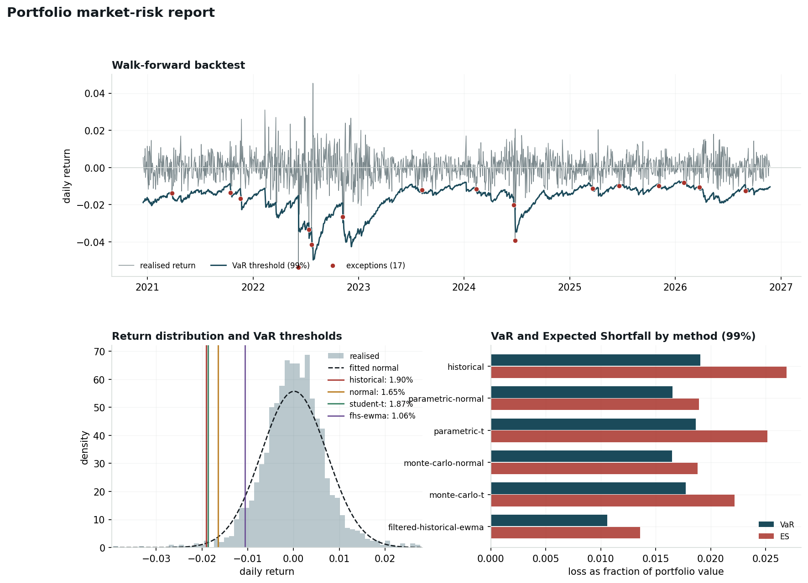

# econophysics-ml

**Sistema cuantitativo de trading y riesgo de mercado** que combina econofísica,
machine learning y backtesting regulatorio sobre series financieras. Desarrollado
desde una formación de grado en física.

> **Aviso:** proyecto con fines educativos y de investigación. Los resultados de
> backtest no garantizan rendimiento futuro. Nada de esto es asesoramiento
> financiero.

---

## Índice

1. [Visión general](#visión-general)
2. [Conceptos de econofísica](#conceptos-de-econofísica)
3. [Conceptos de riesgo de mercado (VaR)](#conceptos-de-riesgo-de-mercado-var)
4. [El hallazgo](#el-hallazgo)
5. [Machine learning](#machine-learning)
6. [Sistema de agentes](#sistema-de-agentes)
7. [Capa de datos](#capa-de-datos)
8. [Análisis macro](#análisis-macro)
9. [Dashboard web](#dashboard-web)
10. [Bot de paper trading](#bot-de-paper-trading)
11. [Estructura del repositorio](#estructura-del-repositorio)
12. [Instalación y uso](#instalación-y-uso)
13. [Tests](#tests)
14. [Referencias](#referencias)

---

## Visión general

El repositorio son varios módulos que comparten una misma **capa de datos**
(`data_layer.py`: Binance REST + CoinGecko + yfinance) y una misma batería de
indicadores de econofísica. Sobre esa base:

```
  data_layer.py ──► precios OHLCV / retornos
        │
        ├─► econofísica        Hurst, DFA, Tsallis-q, LPPLS, RMT, cointegración
        ├─► ML pipeline        features → RandomForest/XGBoost → backtest + DSR/PBO
        ├─► sistema de agentes Bull / Bear / Risk + régimen direccional
        ├─► varengine/         VaR·ES·GARCH·EVT·stress·factores·Basilea·diagnostics
        └─► analisis_macro.py  curva de tasas · VIX term structure · crédito · DXY

  ML + agentes ──► señales ──► paper_trading_bot (Alpaca + Binance testnet)
  todo ──────────► server.py (FastAPI) + static/index.html (dashboard)
```

La idea de fondo: **los mercados no son gaussianos ni eficientes**. Tienen memoria
(persistencia), colas gruesas (eventos extremos mucho más frecuentes de lo que
predice la normal) y volatilidad que se agrupa en rachas. La econofísica da
herramientas para medir eso, y el motor de VaR muestra cuánto **cuesta en capital
regulatorio** ignorarlo.

---

## Conceptos de econofísica

La econofísica aplica métodos de la mecánica estadística a los sistemas
financieros. Los que usa este proyecto:

### Exponente de Hurst (H) y análisis R/S

Mide la **memoria de largo plazo** de una serie. Se estima con el análisis de
rango reescalado (R/S): se parte la serie en bloques de tamaño creciente `n`, en
cada uno se calcula el rango acumulado dividido por el desvío estándar, y la
pendiente de `log(R/S)` contra `log(n)` es H.

| Valor | Interpretación | Estrategia implícita |
|---|---|---|
| H ≈ 0.5 | ruido (camino aleatorio, sin memoria) | sin ventaja estadística |
| H > 0.5 | **persistente**: una subida tiende a seguir de otra subida | trend following / momentum |
| H < 0.5 | **anti-persistente**: reversión a la media | comprar caídas, vender subidas |

Implementado en `econofisica_sistema.py` (`AnalisisHurst`) y, de forma robusta con
regresión sobre escalas logarítmicas, en `econofisica_mediano_largo_plazo.py`.

### DFA — Detrended Fluctuation Analysis

Variante del cálculo de H que **quita la tendencia local** de cada ventana antes
de medir la fluctuación. Es más estable que R/S cuando la serie tiene tendencias
suaves o no estacionariedad, así que sirve como segunda opinión sobre H
(`AnalisisHurst.calcular_dfa`).

### Dimensión fractal

`D = 2 − H`. Cuantifica la "rugosidad" de la trayectoria del precio: cuanto más
cerca de 2, más errática y menos predecible; cerca de 1, más suave y tendencial.
Se usa como feature en el modelo de ML.

### Entropía de Tsallis / estadística-q

La distribución de retornos diarios tiene **colas más gruesas** que una gaussiana.
La *q-gaussiana* de Tsallis interpola entre la normal (`q → 1`) y distribuciones
con colas de ley de potencia (`q > 1`):

- `q ≈ 1.0` – casi gaussiano
- `q ≈ 1.3` – cola gruesa moderada (acción madura)
- `q ≈ 1.5–1.7` – cola gruesa fuerte (crypto)
- `q > 1.7` – incertidumbre extrema

`AnalisisTsallis` ajusta `q` por mínimos cuadrados sobre el histograma de retornos,
con un fallback basado en curtosis si el ajuste no converge.

### LPPLS — Log-Periodic Power Law Singularity (modelo de burbujas de Sornette)

Una burbuja se modela como un crecimiento **super-exponencial** (más rápido que el
interés compuesto) con **oscilaciones log-periódicas** que se aceleran hacia un
tiempo crítico `tc` — la fecha probable del cambio de régimen o crash. `DetectorBurbuja`
(en `econofisica_mediano_largo_plazo.py`) ajusta los 7 parámetros del LPPLS por
optimización no lineal con múltiples reinicios y devuelve un score de burbuja y una
estimación de `tc`.

### RMT — Teoría de Matrices Aleatorias

En una cartera de N activos con T observaciones, buena parte de la matriz de
correlaciones es **ruido**. La RMT compara los autovalores empíricos contra el
espectro de Marchenko-Pastur (lo que se esperaría de datos puramente aleatorios):
los autovalores que caen **dentro** de la banda teórica son ruido y se filtran;
los que la superan son estructura real (factores de mercado, sectores). `RMT_Correlaciones`
usa esto para limpiar la covarianza antes de optimizar.

### Optimización por entropía y cointegración

- **Optimización robusta** (`OptimizadorRobust`): en vez de maximizar Sharpe sobre
  una covarianza ruidosa, maximiza la entropía de los pesos (diversificación) con
  una penalización por riesgo y una restricción de drawdown.
- **Cointegración** (`AnalisisCoIntegracion`): test de Engle-Granger sobre todos los
  pares. Dos activos cointegrados tienen un spread estacionario (con vida media de
  reversión finita) → base para pairs trading.

---

## Conceptos de riesgo de mercado (VaR)

El paquete `varengine/` implementa desde cero la medición de riesgo de mercado y
su validación supervisora. Es el módulo con test más completos del repo
(97 tests que verifican **propiedades matemáticas**, no snapshots).

> 📄 **[docs/METHODOLOGY.md](docs/METHODOLOGY.md)** — documento de referencia con
> las fórmulas, hipótesis nulas y supuestos de todo el framework.

### Value at Risk (VaR)

La pérdida que **no se supera** con una probabilidad dada, en un horizonte dado.
"VaR a 1 día 99% = 1.9%" significa: 1 día de cada 100, esperamos perder más del
1.9% del valor de la cartera. Convención del código: **el VaR se reporta como un
número positivo que representa una pérdida**.

Cinco métodos, que **discrepan a propósito** — la discrepancia es lo interesante:

| Método | Supuesto | Fortaleza | Debilidad |
|---|---|---|---|
| **Histórico** | ninguno; reusa la distribución empírica | captura colas y asimetría reales | no puede producir una pérdida que nunca ocurrió; pesa igual una crisis de hace 2 años que ayer |
| **Paramétrico normal** | retornos ~ N(μ, σ) | rápido, suave, descomponible | **subestima el riesgo de cola sistemáticamente** |
| **Paramétrico Student-t** | retornos ~ t con ν grados de libertad | corrige las colas gruesas a bajo costo | ν es inestable en ventanas cortas (el código lo acota en 2.05 y lo avisa) |
| **Monte Carlo** | distribución conjunta asumida (cópula gaussiana + marginales normal o t) | maneja instrumentos no lineales y horizontes multi-día | error de simulación; depende mucho del modelo |
| **Filtered Historical Simulation** | forma de la cola empírica + **volatilidad condicional** (EWMA o GARCH) | reacciona a la volatilidad de *hoy*, no al promedio de la ventana; suele arreglar el clustering de excepciones | necesita un buen modelo de volatilidad; el escalado multi-día hereda los defectos de raíz-del-tiempo |

### Volatilidad condicional (EWMA y GARCH)

Los cuatro primeros métodos asumen que la distribución de retornos es estable
sobre la ventana. **No lo es**: la volatilidad se agrupa en rachas, así que un σ
estático de 250 días queda alto después de un período calmo y bajo justo cuando
llega el shock. Ese único supuesto es lo que un backtest walk-forward destapa como
excepciones agrupadas (Christoffersen) y, seguido, como exceso de excepciones
(Kupiec).

- **EWMA** (RiskMetrics): `σ²_t = λ·σ²_{t-1} + (1−λ)·r²_{t-1}`, con `λ = 0.94` por
  convención. Un solo parámetro, sin ajuste — barato para correr dentro de un
  backtest rodante.
- **GARCH(1,1)**: `σ²_t = ω + α·ε²_{t-1} + β·σ²_{t-1}`, tres parámetros ajustados
  por máxima verosimilitud (normal o t). Revierte a la varianza de largo plazo
  `ω/(1−α−β)`, así que sus pronósticos multi-día tiran hacia el nivel
  incondicional en vez de quedarse planos.

La **Filtered Historical Simulation** los usa así: estandariza `z_t = r_t/σ_t`
(los `z` quedan casi i.i.d., el clustering se dividió), toma el cuantil empírico
de `z`, y lo reescala por el σ pronosticado para mañana. La forma de la cola sale
de toda la historia; su *escala* es la volatilidad de hoy.

### Extreme Value Theory (EVT — peaks-over-threshold)

A 99.5% o 99.9% de confianza, la simulación histórica casi no tiene datos (1000
días dan 5 observaciones más allá del 99.5%). El teorema de
Pickands-Balkema-de Haan dice que los excesos sobre un umbral alto convergen a una
**distribución de Pareto generalizada (GPD)**, sea cual sea la distribución madre.
`fit_gpd` ajusta la GPD al puñado de excedencias; `evt_var` / `evt_expected_shortfall`
leen los cuantiles extremos de la GPD ajustada.

El parámetro de forma `ξ` es toda la historia:

- `ξ > 0` — cola pesada (ley de potencia). El índice de cola es `1/ξ`; los momentos
  de orden mayor a `1/ξ` no existen. Equity diario: típicamente `ξ ≈ 0.2–0.3`.
- `ξ = 0` — cola exponencial (una normal cae acá).
- `ξ < 0` — cola acotada (hay una pérdida máxima dura).

### Expected Shortfall (ES / CVaR)

El VaR te dice el **umbral**; el ES te dice la **pérdida promedio una vez que lo
cruzaste**. Basilea III / FRTB **reemplazó el VaR por el ES al 97.5%** como medida
regulatoria de riesgo de mercado, por dos razones:

1. El ES es **subaditivo** (coherente): nunca dice que una cartera diversificada
   es más riesgosa que la suma de sus partes. El VaR sí puede decir eso.
2. El ES mira *dentro* de la cola; el VaR es ciego a qué tan mala es la pérdida
   una vez superado el umbral.

### Backtesting: ¿el modelo de VaR realmente funciona?

Producir un número de VaR es fácil. Demostrar que está **calibrado** es lo que lo
separa de una planilla de cálculo, y es lo que exige el regulador. La lógica es un
test de hipótesis sobre la **secuencia de excepciones** (los días en que la pérdida
real superó al VaR pronosticado), usando **validación walk-forward**: cada
pronóstico usa solo información disponible ese día (ventana rodante de 250 días).

**Test de Kupiec (cobertura incondicional).** ¿El *número* de excepciones es el
correcto? Un modelo al 99% sobre 1000 días debería fallar ~10 veces. 25 fallos
significa que subestima el riesgo. Estadístico de razón de verosimilitud, χ² con
1 grado de libertad.

**Test de Christoffersen (independencia).** ¿Las excepciones están *repartidas* o
*agrupadas*? Un modelo puede tener el número exacto de fallos esperados y aun así
ser inservible si todos caen en la misma semana — la firma de un modelo que usa
una volatilidad estática contra retornos que se agrupan en rachas. Ajusta una
cadena de Markov de primer orden a la secuencia y testea si la probabilidad de un
fallo depende de si ayer hubo fallo.

> **Por qué importa más de lo que parece:** en el test suite hay un caso construido
> a propósito — dos secuencias de excepciones con el **mismo conteo**, donde Kupiec
> no las distingue y Christoffersen **rechaza una** (la agrupada). Ver
> `tests/test_varengine.py::TestChristoffersen::test_kupiec_blind_to_clustering`.

**Cobertura condicional.** El test conjunto (`LR_cc = LR_kupiec + LR_ind`, χ² con
2 g.l.). Es el que hay que citar: un modelo debe pasar los dos para ser usable.

**Backtesting del Expected Shortfall (Acerbi-Székely, 2014).** Kupiec y
Christoffersen solo miran *si* el VaR fue superado; son ciegos a *cuánto* se pasó
la pérdida, que es justo lo que el ES debería predecir. Como FRTB hizo del ES la
medida regulatoria, el modelo que hay que validar es el ES. El estadístico Z2
promedia, sobre los días de excepción, la pérdida real dividida por el ES
pronosticado; bajo un ES bien calibrado `E[Z2] = 0`, y `Z2 < 0` significa que las
pérdidas más allá del VaR fueron peores de lo que el ES decía. La significancia
sale de un bootstrap. **Un modelo puede pasar Kupiec y fallar acá** — es lo que
pasa con la simulación histórica en el hallazgo de abajo.

### VaR componente, marginal e incremental

Después del número de titular viene siempre la pregunta: *¿de qué posición viene
el riesgo?* `Portfolio.component_var` la responde en unidades de VaR:

- **marginal** — `∂VaR/∂w_i`: el VaR extra por aumentar marginalmente la posición
  `i`.
- **componente** — `w_i · marginal_i`: los componentes suman exactamente al VaR de
  la cartera, así que su porcentaje es un presupuesto de riesgo limpio.
- **incremental** — `VaR(cartera) − VaR(cartera sin i)`: lo que se ahorraría
  sacando la posición entera. A diferencia del componente, captura el efecto no
  lineal de diversificación (puede ser negativo: la posición es un diversificador).

### Covarianza con shrinkage (Ledoit-Wolf)

La covarianza muestral es insesgada pero ruidosa: con N activos tiene `N(N+1)/2`
parámetros y sus autovalores extremos están mal estimados — que es justo en lo que
se apoya un modelo de riesgo. El shrinkage de Ledoit-Wolf tira la matriz muestral
hacia un objetivo estructurado, con una intensidad elegida analíticamente para
minimizar el error esperado. `Portfolio(prices, shrink=True)` lo activa.

### Stress testing (replay histórico, hipotético y reverso)

El VaR y el ES responden "¿qué tan malo es un día malo *normal*?". No dicen nada
de un evento concreto — un shock de tasas, un 2008 — porque eso vive donde no hay
datos para ajustar. El stress testing pregunta otra cosa: *dado este set exacto de
movimientos de mercado, ¿qué le pasa a la cartera?*. Tres modos, todos esperados
por un supervisor:

- **Replay histórico** — se toman los movimientos reales de una ventana de crisis
  (GFC 2008, China 2015, Volmageddon 2018, Q4-2018, COVID marzo-2020, tasas 2022,
  y colapsos cripto: **Terra/UST mayo-2022, 3AC junio-2022, FTX noviembre-2022**)
  y se aplican a las posiciones de hoy. Sin modelo ni distribución.
- **Hipotético / paramétrico** — un set de movimientos de factores definido a mano
  (`equity −30%, crédito −15%, oil −20%, oro +8%`; o `stablecoin_depeg`,
  `exchange_insolvency` para cripto). La única forma de estresar un escenario que
  nunca pasó.
- **Reverse stress** — se fija primero la pérdida ("¿qué nos costaría el 10% del
  libro?") y se resuelve qué movimientos de mercado la producen. Suele revelar el
  escenario que no estabas mirando.

La cartera se mapea a un set chico de factores tradables (`SPY`, `IEF`, `HYG`,
`DXY`, `GLD`, oil, `BTC-USD`) por regresión (`factor_betas`). Cuando todos los
activos tienen historia en la ventana, el replay usa los retornos reales de los
activos y el supuesto de linealidad desaparece.

### Modelo de factores equity

Un banco nunca reporta riesgo de equity sin descomponerlo en factores. La mayor
parte del retorno de una cartera no es habilidad — es **exposición** al mercado,
a small caps, a acciones baratas, a ganadores recientes, a calidad, a baja
volatilidad. Se regresa `r_cartera − RF` sobre **Fama-French 5 + momentum**
(datos de la Ken French Data Library) o factores de estilo por ETF:

- `β_k` — exposición a cada factor, con t-stat.
- `α` anualizado + t-stat — **lo que sobrevive a las exposiciones conocidas.** Si
  `|t| < 2`, el "alpha" no se distingue de ruido.
- descomposición de varianza: cuánto explica cada factor + **% idiosincrático**.
- atribución de retorno: `β_k · E[f_k] · 252`.

Ejemplo real (AAPL, 5 años): market beta ≈ 1.2 (t ≈ 36), `HML` ≈ −0.34 (es un
growth stock), `RMW` ≈ +0.46 (long calidad), alpha ≈ 2.6%/año con t ≈ 0.3 → **no
significativo**; 41% idiosincrático.

### Rigor de backtest — ¿el resultado es real o selección?

Cada parámetro probado y descartado convierte ruido en un Sharpe. Fórmulas de
Bailey & López de Prado (`varengine/diagnostics.py`):

- **Probabilistic Sharpe Ratio (PSR)** — `P(Sharpe real > benchmark)` ajustado por
  asimetría, curtosis y largo de muestra.
- **Deflated Sharpe Ratio (DSR)** — PSR contra el Sharpe que se esperaría *por
  azar* tras `N` pruebas (constante de Euler-Mascheroni + estadística de
  extremos). Una estrategia de puro ruido probada 1000 veces da DSR ≈ 0.
- **Probability of Backtest Overfitting (PBO)** — por combinatorial symmetric
  cross-validation: si el "mejor" en la primera mitad de la muestra deja de serlo
  en la segunda, la búsqueda de parámetros sobreajusta. PBO ≈ 0.5 = la selección
  no aporta información.
- **Purged K-Fold** — CV que saca del train las observaciones cuyo horizonte de
  etiqueta pisa el test (purge) + una franja después (embargo). El pipeline ML
  aplica purge = horizonte de la triple barrera en su walk-forward.

`bot_trading_ml_econofisica.py` imprime el DSR de cada backtest;
`SistemaTrading.evaluar_robustez()` corre una grilla y reporta el PBO.

### Semáforo de Basilea y multiplicador de capital

La regla supervisora que convierte un conteo de excepciones sobre 250 días
hábiles en una **penalización de capital**. El multiplicador se suma al factor
base de 3:

| Zona | Excepciones / 250 días | Multiplicador de capital | Lectura |
|---|---|---|---|
| 🟢 **Verde** | 0–4 | 3.00 | modelo aceptado, sin penalización |
| 🟡 **Amarilla** | 5–9 | 3.40 – 3.85 | bajo revisión, capital regulatorio más alto |
| 🔴 **Roja** | ≥ 10 | 4.00 | modelo rechazado, remediación obligatoria |

Esto es lo que un equipo de riesgos mira antes que cualquier p-valor: **convierte
un supuesto estadístico en un costo concreto**.

### Escalado raíz-del-tiempo

Para pasar de un VaR a 1 día a uno a 10 días se multiplica por `√10`. Esto asume
retornos i.i.d., **lo cual es falso** (la volatilidad se agrupa). Subestima el
riesgo en períodos turbulentos y lo sobreestima en los calmos. Basilea lo permite,
que es la única razón por la que es estándar. El código lo implementa pero lo
trata como convención, no como resultado.

---

## El hallazgo

*Reproducible con* `python var_analysis.py` *(datos sintéticos GARCH(1,1) con
innovaciones Student-t, 1800 días, semilla fija).*



Sobre una cartera con agrupamiento de volatilidad y **curtosis en exceso de 4.89**
(propiedades que tiene toda serie de equity real), los estimadores incondicionales
discrepan un **15.5%**:

| Método | VaR 1 día 99% | Expected Shortfall |
|---|---|---|
| Simulación histórica | 1.905% | 2.690% |
| Paramétrico — Student-t | 1.865% | 2.515% |
| Monte Carlo — Student-t | 1.774% | 2.218% |
| Monte Carlo — normal | 1.649% | 1.880% |
| Paramétrico — normal | 1.652% | 1.894% |
| Filtered historical (EWMA) | 1.060% | 1.360% |

Los métodos con supuesto normal quedan sistemáticamente **abajo** — es el modelo
fallando en medir la cola que fue construido para medir. La FHS queda más abajo
todavía, pero por otro motivo: escala por la volatilidad del *último* día, y la
muestra termina en un tramo calmo. Eso no se juzga en esta tabla sino en el
backtest walk-forward sobre **1549 días**:

| Modelo | Excepciones | Kupiec | ES (Acerbi-Székely) | Zona Basilea |
|---|---|---|---|---|
| Simulación histórica | 23 (1.48%) | no rechazado (p = 0.074) | **RECHAZADO (Z2 = −0.74, p = 0.018)** | 🟢 VERDE — ×3.00 |
| Paramétrico — normal | 25 (1.61%) | **RECHAZADO (p = 0.026)** | **RECHAZADO (Z2 = −0.93, p = 0.008)** | 🟡 **AMARILLA — ×3.40** |
| Paramétrico — Student-t | 24 (1.55%) | **RECHAZADO (p = 0.044)** | **RECHAZADO (Z2 = −0.54, p = 0.040)** | 🟢 VERDE — ×3.00 |
| **Filtered historical (EWMA)** | **17 (1.10%)** | **no rechazado (p = 0.70)** | **no rechazado (Z2 = −0.22, p = 0.23)** | 🟢 **VERDE — ×3.00** |

Hay **dos hallazgos**, no uno:

1. **El supuesto gaussiano tiene un precio calculable.** El VaR paramétrico normal
   es rechazado por Kupiec y cae en zona amarilla: el multiplicador de capital
   regulatorio sube de 3.00 a 3.40. No es una simplificación académica.

2. **Pasar Kupiec no alcanza.** La simulación histórica pasa el test de excepciones
   y queda en verde, pero **falla el backtest del Expected Shortfall** — la
   medida que FRTB realmente usa. Cuando hay una excepción, la pérdida es peor de
   lo que su ES predijo. Un modelo "aprobado" por el semáforo puede estar mal
   calibrado en lo que importa.

La forma de arreglarlo es condicionar por volatilidad: la **filtered historical
simulation con EWMA** clava la tasa de excepciones en 1.10%, pasa Kupiec,
Christoffersen y el test de ES, y queda en verde. Una línea conceptual de más
—dividir por el σ de hoy— y el modelo funciona.

El mismo análisis corre sobre acciones argentinas reales con
`python var_analysis.py --real` (GGAL, YPFD, PAMP, TXAR vía Yahoo Finance) —que
además agrega la suite de stress testing— y desde el dashboard con el endpoint
`POST /api/var`.

---

## Machine learning

`bot_trading_ml_econofisica.py` — pipeline completo: features → clasificador →
backtest realista.

**Features** (`GeneradorFeatures`): mezcla de econofísica y análisis técnico —
Hurst rolling, dimensión fractal, `tsallis_q` local, régimen de volatilidad,
autocorrelación a 5 días, RSI 14/28, posición en bandas de Bollinger, momentum
multi-horizonte (5/10/21/63), retornos rezagados.

**Etiquetado** (`GeneradorLabels`):

- **Triple Barrier** (López de Prado): para cada día, se mira si en los próximos
  N días el precio toca primero un take-profit (+1), un stop-loss (−1) o se agota
  el tiempo (0). Es realista porque incorpora el orden en que llegan las ganancias
  y pérdidas.
- **Fixed Horizon**: alternativa simple, clasifica el retorno acumulado a N días.

**Validación walk-forward** (`ModeloTrading.walk_forward`): se reentrena
periódicamente usando solo el pasado, con **purge** = horizonte de la triple
barrera (las últimas etiquetas de train se resuelven dentro del período de test y
filtran). Entrenar y testear sobre la misma muestra hace que cualquier modelo
parezca excelente.

**Modelo**: RandomForest / XGBoost / GradientBoosting, siempre envuelto en
`CalibratedClassifierCV` para que las probabilidades signifiquen algo (una
predicción "compra con 70%" debe acertar ~70% de las veces).

**Motor de backtest** (`BacktestEngine`): costos de transacción + slippage,
umbral de confianza (solo opera cuando el modelo está seguro), sizing por **Kelly
fraccional**, stop-loss global, y comparación contra Buy & Hold. Métricas: CAGR,
Sharpe, Sortino, Calmar, max drawdown, alpha, y el **Deflated Sharpe Ratio** de
la curva (ver [rigor de backtest](#rigor-de-backtest--el-resultado-es-real-o-selección)).

```bash
python bot_trading_ml_econofisica.py          # corre BTC y AAPL de ejemplo
```

---

## Sistema de agentes

Un **debate estructurado** entre tres agentes que ven el mismo contexto de mercado
y llegan a una decisión.

`sistema_agentes.py` — versión base:

- **Agente Alcista (Bull)**: puntúa señales a favor de comprar (Hurst persistente,
  régimen calmo, RSI sobrevendido, ML positivo, presión compradora de ballenas…).
- **Agente Bajista (Bear)**: puntúa señales a favor de vender (régimen de estrés,
  RSI sobrecomprado, volatilidad extrema, Hurst reversivo…).
- **Risk Manager**: no toma posición; **veta**. Corta la operación si la
  volatilidad supera un límite, si el drawdown de la cartera es crítico, si las
  señales están demasiado equilibradas, o si Bull/Bear piden entrar en un extremo
  de RSI.
- **Motor de debate**: la decisión sale del *edge neto* (`confianza_bull −
  confianza_bear`); el tamaño de posición sale de un **Kelly fraccional** ajustado
  por volatilidad y régimen.
- **Kill switch**: detiene todo ante drawdown máximo, racha de pérdidas o exceso
  de trades por hora.

`regimen_direccional.py` — extiende lo anterior con **régimen direccional**:

| Régimen | Clasificación | Estrategia |
|---|---|---|
| **BULL** | pendiente + estructura de medias + ADX | momentum / trend following, Kelly completo |
| **BEAR** | pendiente negativa, drawdown, ADX | defensiva: solo sobreventa extrema, Kelly reducido, umbral alto |
| **SIDEWAYS** | sin dirección, ADX bajo | reversión a la media: comprar bandas bajas, vender altas, salir rápido |

Los agentes **cambian sus pesos** según el régimen, y además se detecta el régimen
del **mercado general** (SPY para acciones, BTC para crypto) como filtro global.

```bash
python sistema_agentes.py         # debate sobre el top-10 crypto + acciones
python regimen_direccional.py     # versión adaptativa por régimen
```

---

## Capa de datos

`data_layer.py` — interfaz única sobre tres fuentes, con lógica de selección:

| Caso | Fuente | Por qué |
|---|---|---|
| Crypto, corto/mediano plazo | Binance REST | sin delay, precio exacto, klines de 1h/1d |
| Crypto, largo plazo | yfinance | más historia disponible |
| Acciones / ETFs | yfinance | Binance no tiene equity |
| Macro crypto (Fear & Greed, dominancia BTC) | CoinGecko + alternative.me | — |

Incluye caché por TTL según horizonte, normalización de tickers
(`BTCUSDT` ↔ `BTC-USD` ↔ `bitcoin`), y señales de order book / trades grandes
("ballenas") para crypto. Se usa como singleton: `get_data_layer()`.

**Microestructura de perpetuos** (Binance Futures, sin auth): `funding rate`
(lo que los longs pagan a los shorts; positivo y alto = trade long saturado →
contrarian bajista), `basis` del perpetuo (contango vs backwardation),
`open interest` y su cambio a 7d (OI cayendo fuerte = deleveraging), y el
`long/short ratio`. `dl.binance.get_microestructura_cripto("BTCUSDT")`.

---

## Análisis macro

`analisis_macro.py` — los módulos de econofísica analizan activos sueltos; una
mesa mira **el sistema**. `AnalisisMacro` arma un régimen cross-asset con datos
públicos (yfinance, sin API keys):

| Bloque | Qué mira | Lectura |
|---|---|---|
| **Curva de tasas** (`^IRX`, `^FVX`, `^TNX`, `^TYX`) | nivel (10y), pendiente (10y−3m), curvatura | curva invertida = señal recesiva clásica |
| **Term structure del VIX** (`^VIX9D`, `^VIX`, `^VIX3M`, `^MOVE`) | ratio VIX/VIX3M | < 1 contango (calma); > 1 backwardation (pánico) |
| **Spread de crédito** (proxy `HYG` vs `IEF`) | retorno relativo rodante + percentil | HY débil = apetito de riesgo cayendo |
| **Dólar** (`DX-Y.NYB`) | nivel vs media móvil | dólar subiendo = risk-off |
| **Correlaciones** | rodante 60d acciones-bonos, acciones-oro, acciones-dólar | la correlación acciones-bonos se rompió en 2022 |
| **Régimen compuesto** | score risk-on / neutral / risk-off | combina lo anterior |

> El spread de crédito es un **proxy de ETFs**, no un OAS real (el OAS de verdad
> sale de FRED y requiere API key).

```bash
python analisis_macro.py     # reporte macro + gráfico (necesita internet)
```

---

## Dashboard web

`server.py` — API FastAPI + `static/index.html` (dashboard de una sola página con
Chart.js).

```bash
python server.py
# → http://localhost:8000        dashboard
# → http://localhost:8000/docs   API interactiva (Swagger)
```

| Endpoint | Qué hace |
|---|---|
| `POST /api/analizar` | análisis completo de un activo: stats, Hurst, régimen, señal ML, y microestructura de perpetuos para cripto |
| `POST /api/var` | **Value at Risk + backtesting regulatorio**: 5 métodos de VaR, ES, VaR componente, **modelo de factores** (equity), backtest walk-forward con Kupiec / Christoffersen / test de ES / semáforo de Basilea — usa `varengine/` |
| `GET /api/mercado` | **régimen macro / cross-asset**: curva de tasas, VIX term structure, spread de crédito, dólar, correlaciones — usa `analisis_macro.py` |
| `POST /api/portfolio` | optimización de cartera por entropía máxima |
| `GET /api/agentes` | debate Bull/Bear/Risk multi-activo |
| `GET /api/macro` | sentimiento cripto: Fear & Greed, dominancia BTC, top-10 |
| `GET /api/señales` | señales rápidas para varios tickers |
| `GET /api/entrenar/{ticker}` | entrena el modelo ML en background |

El panel **RIESGO — VALUE AT RISK** llama a `/api/var` y muestra la tabla de
métodos, el VaR componente, los tests supervisores (VaR y ES) y el badge de zona
Basilea con su multiplicador de capital. El panel **MACRO / RÉGIMEN DE MERCADO**
llama a `/api/mercado` y se carga al abrir el dashboard.

> Nota: `/api/analizar` sigue devolviendo un `var_95_diario` simple (percentil 5).
> La versión rigurosa —con backtest y tests supervisores— es `varengine/` vía
> `/api/var`.

---

## Bot de paper trading

`paper_trading_bot_fixed.py` — ejecuta el sistema de agentes en vivo contra
**Alpaca (acciones, paper)** y **Binance testnet (crypto)**. Sin dinero real.

- Gestión de riesgo: tamaño máximo por posición, stop-loss / take-profit por
  bracket order, cooldown entre trades del mismo activo, stop global.
- Kill switch que **solo cuenta trades ejecutados** (no análisis).
- Registro de trades en `trades_log.json` (lo lee el dashboard).

```bash
# 1. Pegar las API keys en el dict CONFIG del archivo
# 2. Probar sin ejecutar órdenes:
#    descomentar  bot.modo_señales_solamente()  en el bloque __main__
python paper_trading_bot_fixed.py
```

---

## Estructura del repositorio

```
econophysics-ml/
├── data_layer.py                     capa de datos (Binance · CoinGecko · yfinance)
├── analisis_macro.py                 régimen macro / cross-asset (curva, VIX, crédito, DXY)
├── econofisica_sistema.py            econofísica corto plazo (Hurst, régimen, Tsallis)
├── econofisica_mediano_largo_plazo.py  DFA, LPPLS, RMT, ciclos FFT, cointegración
├── bot_trading_ml_econofisica.py     pipeline ML: features → modelo → backtest
├── sistema_agentes.py                debate Bull / Bear / Risk Manager
├── regimen_direccional.py            agentes adaptativos por régimen BULL/BEAR/SIDEWAYS
├── paper_trading_bot_fixed.py        bot en vivo (Alpaca + Binance testnet)
├── server.py                         API FastAPI
├── static/index.html                 dashboard web
│
├── varengine/                        ── PAQUETE Value at Risk ──
│   ├── data.py                       carga de datos + simulador GARCH(1,1)
│   ├── portfolio.py                  cartera, retornos, covarianza (+ Ledoit-Wolf), VaR componente
│   ├── volatility.py                 volatilidad condicional: EWMA y GARCH(1,1) por MLE
│   ├── var.py                        VaR histórico / paramétrico / Monte Carlo / filtered-historical + ES
│   ├── evt.py                        extreme value theory (peaks-over-threshold, GPD) para la cola lejana
│   ├── backtest.py                   Kupiec, Christoffersen, cobertura condicional, test de ES, Basilea
│   ├── stress.py                     stress testing: replay histórico, hipotético, reverso (+ escenarios cripto)
│   ├── factors.py                    modelo de factores Fama-French / estilo ETF
│   ├── diagnostics.py                PSR, deflated Sharpe, PBO, purged CV
│   ├── plots.py                      figuras del reporte
│   └── README.md                     referencia técnica (inglés)
│
├── var_analysis.py                   análisis VaR end-to-end (reproduce el hallazgo)
├── tests/test_varengine.py           97 tests del motor VaR
├── docs/risk_report.png              salida de var_analysis.py
├── docs/METHODOLOGY.md               documento de metodología (fórmulas y supuestos)
│
├── requirements.txt
├── pyproject.toml
└── README.md
```

`varengine/` es el **único paquete importable**; el resto son scripts que se corren
desde la raíz del repo (`from data_layer import ...`, `import varengine`).

---

## Instalación y uso

Requiere **Python ≥ 3.10** (probado en 3.12).

```bash
git clone https://github.com/QuintanillaF/econophysics-ml
cd econophysics-ml
pip install -r requirements.txt
```

| Quiero… | Comando |
|---|---|
| Reproducir el hallazgo de VaR | `python var_analysis.py` |
| …con datos reales + stress testing (acciones AR) | `python var_analysis.py --real` |
| Régimen macro / cross-asset | `python analisis_macro.py` |
| Levantar el dashboard | `python server.py` → http://localhost:8000 |
| Backtest ML de un activo | `python bot_trading_ml_econofisica.py` |
| Análisis econofísico corto plazo | `python econofisica_sistema.py` |
| Análisis largo plazo (burbujas, RMT) | `python econofisica_mediano_largo_plazo.py` |
| Debate de agentes | `python sistema_agentes.py` |
| Bot en vivo (paper) | editar `CONFIG` y `python paper_trading_bot_fixed.py` |

Dependencias opcionales: `xgboost` (modelo alternativo en el pipeline ML),
`arch` (GARCH más robusto; el de `varengine/` es MLE propio).

---

## Tests

```bash
pip install pytest
python -m pytest              # 97 tests, ~4 min (los backtests rodantes son lentos)
```

Los tests verifican **propiedades matemáticas**, no números de una corrida
anterior: VaR normal contra el cuantil analítico, VaR empírico contra el cuantil
real sobre 200.000 draws, convergencia de Monte Carlo al paramétrico, la identidad
raíz-del-tiempo, que el GARCH recupera la persistencia de datos simulados, que el
modelo de factores recupera betas conocidos, que el Deflated Sharpe rechaza una
estrategia de ruido probada 1000 veces, que el PBO distingue un ganador genuino
del ruido, que el Purged K-Fold deja el gap correcto, que el reverse stress
reproduce la pérdida objetivo, e invariantes estructurales (ES ≥ VaR, VaR
monótono en confianza, componentes de VaR y contribuciones de factores que suman
al total).

---

## Referencias

- Mantegna & Stanley — *An Introduction to Econophysics* (Cambridge, 2000)
- López de Prado — *Advances in Financial Machine Learning* (Wiley, 2018)
- Sornette — *Why Stock Markets Crash* (Princeton, 2003)
- Tsallis — *Introduction to Nonextensive Statistical Mechanics* (Springer, 2009)
- Kupiec (1995) — *Techniques for verifying the accuracy of risk measurement models*
- Christoffersen (1998) — *Evaluating interval forecasts*
- Acerbi & Székely (2014) — *Back-testing Expected Shortfall*
- Barone-Adesi, Giannopoulos & Vosper (1999) — *VaR without correlations for portfolios of derivative securities* (filtered historical simulation)
- McNeil & Frey (2000) — *Estimation of tail-related risk measures for heteroscedastic financial time series: an extreme value approach*
- Ledoit & Wolf (2004) — *Honey, I shrunk the sample covariance matrix*
- J.P. Morgan / Reuters (1996) — *RiskMetrics Technical Document* (EWMA)
- Comité de Basilea (1996) — *Supervisory framework for the use of backtesting*
- Comité de Basilea (2019) — *Minimum capital requirements for market risk* (FRTB)

---

## Autor

**Francisco Nahuel Quintanilla**
Estudiante de grado en Física — Universidad Nacional del Sur, Bahía Blanca, Argentina
[LinkedIn](https://www.linkedin.com/in/francisco-quintanilla-b40367386/)


